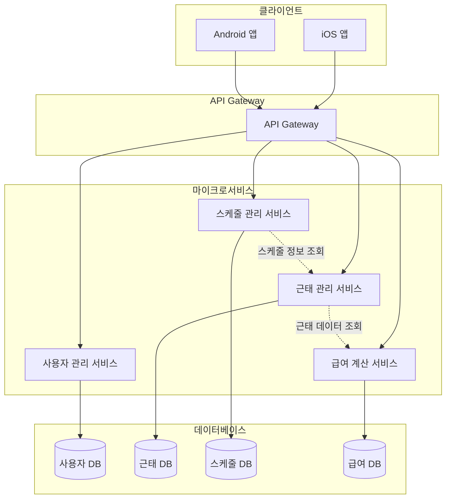

# parttime-pay-ledger

소상공인을 위한 알바 근태/스케줄/급여 정산을 한 번에 관리하는 급여 장부 앱

## 📋 프로젝트 소개

**parttime-pay-ledger**는 소상공인을 위한 알바 관리 애플리케이션입니다. 

많은 소상공인들이 알바생을 고용하고 있지만, 각 알바생들의 급여 계산이 복잡하고 어려워 정산 과정에서 어려움을 겪고 있습니다. 특히 디지털 도구 사용에 익숙하지 않은 연령대의 소상공인들을 위해, 간편하고 직관적인 알바 관리 솔루션을 제공하는 것이 이 프로젝트의 목적입니다.

## ✨ 주요 기능

### 1. 근태 기록 기반 월별 알바비 자동 계산
- 알바생들의 근태 기록을 기반으로 해당 월의 알바비를 자동으로 계산합니다
- 근무 시간, 시급, 추가 수당 등을 종합하여 정확한 급여를 산출합니다

### 2. 알바 근태 관리
- 알바생들의 출퇴근 시간을 기록하고 관리합니다
- 근태 기록을 통해 알바비 정산의 근거를 제공합니다
- 근무 이력 조회 및 통계 기능을 제공합니다

### 3. 알바생 스케줄 관리
- 알바생들의 근무 스케줄을 등록하고 관리할 수 있습니다
- 주간/월간 스케줄을 한눈에 확인할 수 있습니다
- 스케줄 변경 및 알림 기능을 제공합니다

## 🎯 프로젝트 목표

이 프로젝트는 단순히 앱을 만드는 것을 넘어, **전체 개발 생명주기를 경험**하는 것에 의미를 둡니다:

- **바이브 코딩을 통한 앱 개발**: 최신 개발 도구와 방법론을 활용하여 앱을 구현합니다
- **앱 배포 및 마켓플레이스 출시**: 개발한 앱을 실제 사용자들이 다운로드하고 사용할 수 있도록 앱스토어/플레이스토어에 출시합니다
- **전체 스택 구현**: 프론트엔드뿐만 아니라 서버, 데이터베이스, 네트워크 등 백엔드 인프라까지 구현하여 실제 사용 가능한 서비스를 만듭니다

## 🛠 기술 스택

> 기술 스택은 프로젝트 진행에 따라 업데이트됩니다.

- **프론트엔드**: (추가 예정)
- **백엔드**: (추가 예정)
- **데이터베이스**: (추가 예정)
- **배포 환경**: (추가 예정)

## 🏗 시스템 아키텍처

### 아키텍처 개요

본 프로젝트는 **도메인 주도 설계(DDD, Domain-Driven Design)**와 **마이크로서비스 아키텍처**를 기반으로 설계됩니다. 모바일 앱(iOS/Android)과 마이크로서비스 기반 백엔드로 구성되며, 각 서비스는 독립적으로 개발, 배포, 확장이 가능합니다.

### 도메인 주도 설계 (DDD)

본 프로젝트는 **도메인 주도 설계(Domain-Driven Design)** 원칙을 따릅니다. DDD는 복잡한 비즈니스 로직을 도메인 모델 중심으로 설계하여 코드의 가독성, 유지보수성, 확장성을 향상시키는 설계 방법론입니다.

#### DDD 핵심 개념

**1. 도메인 모델 (Domain Model)**
- 비즈니스 로직의 핵심을 표현하는 모델
- 알바 급여 장부 시스템의 주요 도메인:
  - **직원(Employee)**: 알바생 정보 관리
  - **근태(Attendance)**: 출퇴근 기록 및 근무 시간 관리
  - **스케줄(Schedule)**: 근무 스케줄 관리
  - **급여(Payroll)**: 급여 계산 및 정산
  - **시급(Wage)**: 시급 및 수당 정책 관리

**2. 엔티티 (Entity)**
- 고유한 식별자를 가지는 도메인 객체
- 예: `Employee`, `Attendance`, `Payroll`

**3. 값 객체 (Value Object)**
- 식별자 없이 값으로만 구분되는 불변 객체
- 예: `Money`, `TimeRange`, `WorkHours`

**4. 집계 (Aggregate)**
- 관련된 엔티티와 값 객체를 하나의 단위로 묶는 개념
- 집계 루트(Aggregate Root)를 통해 접근
- 예: `Payroll` 집계는 `Attendance` 엔티티들을 포함

**5. 리포지토리 (Repository)**
- 도메인 객체의 영속성을 추상화하는 인터페이스
- 도메인 로직과 데이터 접근 로직의 분리

**6. 도메인 서비스 (Domain Service)**
- 여러 엔티티에 걸친 복잡한 비즈니스 로직을 처리하는 서비스
- 예: 급여 계산 로직

**7. 애플리케이션 서비스 (Application Service)**
- 사용자 요청을 처리하고 도메인 서비스를 조율하는 계층
- 트랜잭션 관리, 권한 검증 등

#### DDD 계층 구조

```
┌─────────────────────────────────────┐
│   Presentation Layer (프레젠테이션)   │
│   - API Controllers                 │
│   - DTOs                            │
└─────────────────────────────────────┘
              ↓
┌─────────────────────────────────────┐
│   Application Layer (애플리케이션)   │
│   - Application Services            │
│   - Use Cases                       │
│   - DTOs                            │
└─────────────────────────────────────┘
              ↓
┌─────────────────────────────────────┐
│   Domain Layer (도메인)              │
│   - Entities                        │
│   - Value Objects                   │
│   - Domain Services                 │
│   - Repository Interfaces           │
│   - Domain Events                   │
└─────────────────────────────────────┘
              ↓
┌─────────────────────────────────────┐
│   Infrastructure Layer (인프라)      │
│   - Repository Implementations      │
│   - Database                        │
│   - External Services               │
└─────────────────────────────────────┘
```

#### 도메인 모델 예시

**직원(Employee) 엔티티**
- 고유 ID, 이름, 연락처, 시급 정보
- 근태 기록과의 관계

**근태(Attendance) 엔티티**
- 출근 시간, 퇴근 시간
- 근무 시간 계산 로직
- 직원과의 관계

**급여(Payroll) 집계**
- 특정 월의 급여 정보
- 해당 월의 모든 근태 기록 포함
- 급여 계산 비즈니스 로직

#### DDD의 장점

1. **비즈니스 로직 명확성**: 도메인 모델이 비즈니스 요구사항을 직접적으로 표현
2. **유지보수성**: 도메인 로직이 한 곳에 집중되어 변경이 용이
3. **테스트 용이성**: 도메인 로직이 인프라와 분리되어 단위 테스트가 쉬움
4. **확장성**: 새로운 기능 추가 시 기존 도메인 모델을 확장하여 구현 가능
5. **팀 협업**: 도메인 전문가와 개발자가 공통 언어(유비쿼터스 언어)로 소통

주요 구성 요소:
- **프론트엔드**: 모바일 앱 (iOS/Android)
- **API Gateway**: 모든 클라이언트 요청의 단일 진입점
- **마이크로서비스**: 기능별로 분리된 독립적인 서비스들
- **데이터베이스**: 각 서비스별 데이터베이스 또는 공유 데이터베이스
- **인증 및 보안**: 사용자 인증, 권한 관리, 데이터 암호화

### 주요 컴포넌트

#### 1. 모바일 앱 (Frontend)
- iOS 및 Android 네이티브 앱 또는 크로스플랫폼 프레임워크 사용
- 사용자 인터페이스 및 비즈니스 로직 처리
- API Gateway를 통해 백엔드 서비스와 통신

#### 2. API Gateway
- 모든 클라이언트 요청의 단일 진입점
- 라우팅, 로드 밸런싱, 인증/인가 처리
- 요청/응답 변환 및 모니터링

#### 3. 마이크로서비스

**사용자 관리 서비스 (User Service)**
- 사용자(소상공인, 알바생) 등록 및 인증
- 사용자 프로필 관리
- 권한 관리

**근태 관리 서비스 (Attendance Service)**
- 알바생의 출퇴근 시간 기록
- 근태 이력 조회 및 통계
- 근태 데이터 검증

**스케줄 관리 서비스 (Schedule Service)**
- 알바생 근무 스케줄 등록 및 관리
- 스케줄 조회 및 변경
- 스케줄 알림 처리

**급여 계산 서비스 (Payroll Service)**
- 근태 데이터 기반 급여 자동 계산
- 시급, 추가 수당 등 급여 항목 관리
- 월별 급여 정산서 생성

#### 4. 데이터베이스
- 각 마이크로서비스별 독립적인 데이터베이스 또는 공유 데이터베이스
- 데이터 일관성 및 트랜잭션 관리
- 데이터 백업 및 복구 전략

### 시스템 아키텍처 다이어그램



### 데이터 흐름

1. **사용자 요청**: 모바일 앱에서 사용자 액션 발생
2. **API Gateway**: 요청을 받아 인증/인가 처리 후 적절한 마이크로서비스로 라우팅
3. **마이크로서비스 처리**: 각 서비스가 비즈니스 로직을 수행하고 필요한 경우 다른 서비스와 통신
4. **데이터베이스 접근**: 서비스가 해당 데이터베이스에서 데이터 조회/저장
5. **응답 반환**: 처리 결과를 API Gateway를 통해 모바일 앱으로 반환

### 향후 결정 사항

다음 사항들은 프로젝트 진행에 따라 구체적으로 결정될 예정입니다:

- **프론트엔드 기술 스택**: React Native, Flutter, 네이티브 등
- **백엔드 프레임워크**: Node.js, Spring Boot, Django 등
- **API Gateway 솔루션**: Kong, AWS API Gateway, 자체 구현 등
- **데이터베이스**: PostgreSQL, MySQL, MongoDB 등
- **서비스 간 통신**: REST API, GraphQL, gRPC 등
- **인증 방식**: JWT, OAuth 2.0 등
- **배포 전략**: Docker, Kubernetes, 클라우드 서비스(AWS, GCP, Azure) 등
- **모니터링 및 로깅**: ELK Stack, Prometheus, Grafana 등

## 📁 프로젝트 구조

본 프로젝트는 DDD 원칙에 따라 계층별로 구조화됩니다:

```
parttime-pay-ledger/
├── README.md
├── docs/                          # 문서
│   ├── architecture/             # 아키텍처 문서
│   ├── domain/                   # 도메인 모델 문서
│   └── api/                      # API 문서
│
├── services/                      # 마이크로서비스
│   ├── user-service/             # 사용자 관리 서비스
│   │   ├── src/
│   │   │   ├── domain/           # 도메인 계층
│   │   │   │   ├── entities/     # 엔티티
│   │   │   │   ├── value-objects/# 값 객체
│   │   │   │   ├── repositories/ # 리포지토리 인터페이스
│   │   │   │   ├── services/     # 도메인 서비스
│   │   │   │   └── events/       # 도메인 이벤트
│   │   │   ├── application/      # 애플리케이션 계층
│   │   │   │   ├── services/     # 애플리케이션 서비스
│   │   │   │   ├── use-cases/    # 유스케이스
│   │   │   │   └── dtos/         # 데이터 전송 객체
│   │   │   ├── infrastructure/   # 인프라 계층
│   │   │   │   ├── persistence/  # 리포지토리 구현
│   │   │   │   ├── database/     # 데이터베이스 설정
│   │   │   │   └── external/     # 외부 서비스 연동
│   │   │   └── presentation/     # 프레젠테이션 계층
│   │   │       ├── controllers/  # API 컨트롤러
│   │   │       └── middleware/   # 미들웨어
│   │   └── tests/                # 테스트
│   │
│   ├── attendance-service/        # 근태 관리 서비스
│   │   └── [동일한 구조]
│   │
│   ├── schedule-service/          # 스케줄 관리 서비스
│   │   └── [동일한 구조]
│   │
│   └── payroll-service/          # 급여 계산 서비스
│       └── [동일한 구조]
│
├── shared/                        # 공유 모듈
│   ├── domain/                   # 공유 도메인 모델
│   ├── events/                   # 공유 이벤트
│   └── utils/                    # 유틸리티
│
├── api-gateway/                   # API Gateway
│   └── [API Gateway 구현]
│
└── mobile/                        # 모바일 앱
    ├── ios/                      # iOS 앱
    └── android/                  # Android 앱
```

### 도메인별 구조 예시

각 마이크로서비스는 다음과 같은 도메인 구조를 가집니다:

**예: 급여 계산 서비스 (payroll-service)**

```
payroll-service/
└── src/
    ├── domain/
    │   ├── entities/
    │   │   ├── Payroll.ts        # 급여 엔티티
    │   │   └── PayrollItem.ts    # 급여 항목 엔티티
    │   ├── value-objects/
    │   │   ├── Money.ts          # 금액 값 객체
    │   │   ├── WorkHours.ts      # 근무 시간 값 객체
    │   │   └── Period.ts         # 기간 값 객체
    │   ├── repositories/
    │   │   └── IPayrollRepository.ts  # 리포지토리 인터페이스
    │   ├── services/
    │   │   └── PayrollCalculationService.ts  # 급여 계산 도메인 서비스
    │   └── events/
    │       └── PayrollCalculatedEvent.ts     # 도메인 이벤트
    │
    ├── application/
    │   ├── services/
    │   │   └── PayrollApplicationService.ts  # 애플리케이션 서비스
    │   ├── use-cases/
    │   │   ├── CalculateMonthlyPayroll.ts    # 월별 급여 계산 유스케이스
    │   │   └── GeneratePayrollStatement.ts   # 급여 명세서 생성 유스케이스
    │   └── dtos/
    │       └── PayrollDto.ts
    │
    ├── infrastructure/
    │   ├── persistence/
    │   │   └── PayrollRepository.ts           # 리포지토리 구현
    │   └── database/
    │       └── migrations/
    │
    └── presentation/
        └── controllers/
            └── PayrollController.ts           # API 컨트롤러
```

## 🚀 설치 및 실행 방법

> 설치 및 실행 방법은 개발 진행에 따라 업데이트됩니다.

## 🤝 기여 방법

이 프로젝트에 기여하고 싶으시다면 언제든지 이슈를 등록하거나 Pull Request를 보내주세요!

## 📄 라이선스

(추가 예정)
